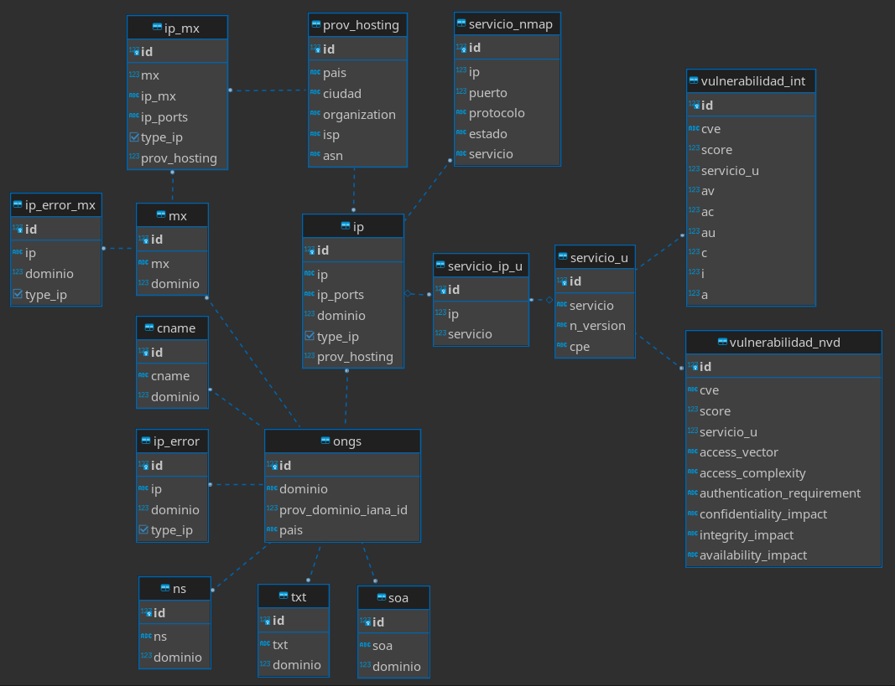

# dataCollection

En este repositorio se encuentran los scripts que se usaron para la recolección de datos públicos de la infraestructura digital de 43 organizaciones no gubernamentales de la Comunidad Ándina de Naciones.


## Observaciones sobre funcionamiento

1. Estos scripts se ejecutaron en un sistema operativo con kernel Linux en su versión 5.10.

2. El script `host_lookup.py` solo funcionará en un sistema operativo GNU/Linux como está escrito, pues usa la utilidad `timeout`.

## Requisitos de servicios

Se utilizaron dos servicios que requieren de cuentas de usuario para el uso de sus API.

1. **shodan.io**: Se requiere de una cuenta con membresía o membresía académica. La opción de membresía académica es gratuita para personas pertenecientes a instituciones educativas. Puede crearse una cuenta de Shodan [aquí](https://account.shodan.io/register).

2. **bit.io**: Se requiere de una cuenta gratuita. Puede crearse una cuenta [aquí](https://bit.io/register). bit.io usa PostgreSQL para almacenar las bases de datos. Se recomienda usar algun cliente de SQL para visualizar los datos.

## Instrucciones

1. Clonar el repositorio, ejecutando `git clone https://github.com/danilopedraza/dataCollection.git`.

2. Instalar los requerimientos con

``pip install -r requirements.txt``

3. Instalar Nmap. Puede descargarse [aquí](https://nmap.org/download).

4. Crear un archivo (en el directorio del repositorio) llamado `shodan_api_key.txt` donde se encuentre solamente la clave de la API de Shodan correspondiente a una cuenta con membresía, membresía académica.

5. En bit.io, crear una base de datos relacional con los comandos SQL en `ONGS.sql`. Los comandos describen las tablas que se llenarán en los scripts. Este es el diagrama entidad-relación correspondiente a la base de datos descrita en `ONGS.sql`:



6. Crear un archivo (en el directorio del repositorio) llamado `db_name.txt` donde se encuentre solamente el nombre de la base de datos creada en bit.io. Este nombre es de la forma

``{nombre de usuario}/{nombre de la base de datos}``

7. Crear un archivo (en el directorio del repositorio) llamado `bitio_api_key.txt` donde se encuentre solamente la clave de API de bit.io correspondiente a la base de datos creada en el paso anterior. La clave debe corresponder a un usuario con permisos para leer y modificar la base de datos.

8. Añadir al directorio del repositorio un archivo llamado `domains.csv`. El archivo debe tener dos columnas: una llamada `domain` y otra llamada `country`. En cada fila, la columna `domain` tiene un dominio a estudiar y la columna `country` tiene el país de la organización a la que corresponde ese dominio.

9. Ejecutar `main.py`. Con main.py se ejecutan las rutinas que obtienen los registros DNS de los dominios en `domains.csv`. Luego se realizan escaneos a las direcciones IP encontradas en los registros. En esta etapa toda la información es obtenida con Shodan.

10. Al terminar la ejecución de `main.py` se creará un archivo llamado `db.sql` donde estará condensada toda la información recolectada con Shodan. La información de este archivo puede ser incluída en la base de datos de la siguiente manera, asumiendo que el nombre de el esquema es `public`:
    1. Eliminar las tablas con los siguientes comandos:

    ```
    DROP SCHEMA public CASCADE;
    CREATE SCHEMA public;
    ```

    2. Crear el esquema de nuevo como en el paso 5.
    3. Ejecutar los comandos en `db.sql` en la consola de bit.io o con algún cliente de SQL.

11. Ejecutar `loadServices.py`. Al finalizar quedará creado el archivo `servicios.sql` con los servicios desplegados de todas las direcciones IP. De igual manera que el punto anterior, hay que subir manualmente este contenido a la base de datos.

12. Ejecutar `host_lookup.py`. La rutina principal de este archivo escaneará las direcciones IP encontradas con Nmap. El escaneo de cada dirección tiene un límite de tiempo de 12 horas y la rutina realiza todos los escaneos al mismo tiempo. La ejecución de este script dejará al final un archivo llamado `hosts.csv` con la información obtenida.

13. Ejecutar el archivo `inserts-from-csv.py`, que creará un archivo llamado `nmap-inserts.sql` que creará las
inserciones en SQL correspondientes. Los comandos en este archivo deben ser ingresados a la base de datos manualmente.

14. Añadir a la tabla `servicio_u` una nueva columna llamada `cpe`, del tipo `varchar(100)`.

15. Para cada fila de `servicio_u` llenar la columna `cpe` con el código CPE correspondiente más preciso. Nosotros usamos el [diccionario web de la NVD](https://nvd.nist.gov/products/cpe/search).

16. Ejecutar `get_vuln_info.py`. Al terminar dejará un archivo llamado `vulns.sql` con inserciones a la tabla de vulnerabilidades de la base de datos, que también deben ingresarse manualmente.

Tras este procedimiento se han recolectado todos los datos para las tablas que se construyeron al principio.


